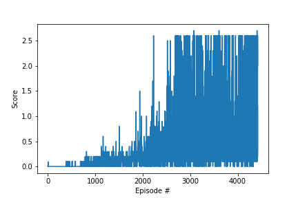

# Report

## RL algorithm
For this problem I use Deep Deterministic Policy Gradient (DDPG) algorithm[1]. DDPG algorithm uses two function approximation.
One function to approximate the policy gradient, whose input is the current state and output is the action. 
One function to approximate the value function, which takes state and action as the input and returns the expected value of the state-action pair. 
DDPG algorithm successfully resolved the issue that exact Q-value can not be calculated when state and/or action are in continuous space. 
In this case, I use 2-agent environment. These agents share the same replay buffer and has no other kinds of information sharing during the training process.

The actor network has 2 hidden layers, both fully connected and with 512 and 256 neurons respectively. 
The network use ReLu as non-linear activation function. 
The output layers use Tanh as the activation function and return a vector of length 4.

The critic Network has 2 hidden layers with the same model atchitecture. 
The only difference is that Critic network return a scaler which is the estimated Q-value.

USe Adam optimized to optimize both Actor and Critic Network.

Hyperparameters: 
BUFFER_SIZE = int(1e5)  # replay buffer size 
BATCH_SIZE = 128        # minibatch size 
GAMMA = 1               # discount factor 
TAU = 1e-2              # for soft update of target parameters 
LR_ACTOR = 1e-4         # learning rate of the actor  
LR_CRITIC = 1e-3        # learning rate of the critic 
WEIGHT_DECAY = 0        # L2 weight decay 

In this case there is not discount in returns so parameter GAMMA is set to 1. 

## Results
This problem is considerd solved after the average of the maximum scores of these agents achieve +0.5 over 100 episodes. The performance of this model is evaluated by the maximum score of these two agents. It is a special kind of cooperateive relationship[2].
We achieve this average score and continue training to generate the score plot:

## Future Work
It would be worthwhile to try differenct neural network architectures. 
It is also great if we can train our agents in a multi-agent environment where information sharing is possible. 
Simpler pocicy-based methods should also be able to achieve the goal. Change rewards function to adjust the behavior may improve overall performance. 

## References
[1] <a href="https://arxiv.org/pdf/1509.02971.pdf" target="_blank">Continuous control with deep reinforcement learning</a> 
[2] <a href="https://arxiv.org/pdf/1706.02275.pdf" target="_blank">Multi-agent actor-critic for mixed cooperative-competitive envirionments</a> 
